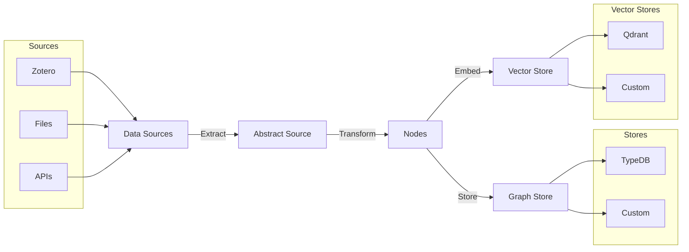

# Welcome to Database Builder Libs

Build powerful knowledge graph applications with ease using modern AI-native technologies.

## What is Database Builder Libs?

Database Builder Libs is a free, open-source Python library that provides everything you need to create sophisticated knowledge graph applications. It seamlessly integrates with AI-native technologies like **TypeDB** for graph storage and **Qdrant** for vector search, making it the perfect foundation for building intelligent data systems.

### Key Features

- Store complex relationships and facts using TypeDB's powerful graph database
- Sync and retrieve data from various sources including Zotero, with more coming soon
- Embed any document type for use in RAG (Retrieval-Augmented Generation) systems
- Mix and match components to build exactly what you need
- Built with Python type hints for better IDE support and fewer runtime errors

## Architecture Overview

## Getting Started

!!! tip "New to Database Builder Libs?"
    Start with our [Getting Started Guide](getting_started/00_getting_started.md) to set up your first knowledge graph in minutes.

## Learn More

- **[Learn the Basics](getting_started/01_learn_the_basics.md)** - Understand core concepts like nodes, stores, and sources
- **[View Examples](getting_started/02_examples.md)** - Explore practical examples and best practices
- **[API Reference](main_modules/00_overview.md)** - Detailed documentation of all modules and classes

## Community

Database Builder Libs is developed by students and teachers at HAN University of Applied Sciences as part of their research project.

- **GitHub**: [AIM-kennisplatformen/database-builder-libs](https://github.com/AIM-kennisplatformen/database-builder-libs)
- **Issues**: [Report bugs or request features](https://github.com/AIM-kennisplatformen/database-builder-libs/issues)
- **Contributing**: [Read our contribution guide](contributing/rules.md)

## License

Database Builder Libs is licensed under the [Apache 2.0 License](https://github.com/AIM-kennisplatformen/database-builder-libs/blob/main/LICENSE), making it free for both personal and commercial use.

---

!!! info "Ready to build something amazing?"
    [Get Started Now](getting_started/00_getting_started.md){ .md-button .md-button--primary } or [Browse Examples](getting_started/02_examples.md){ .md-button }
