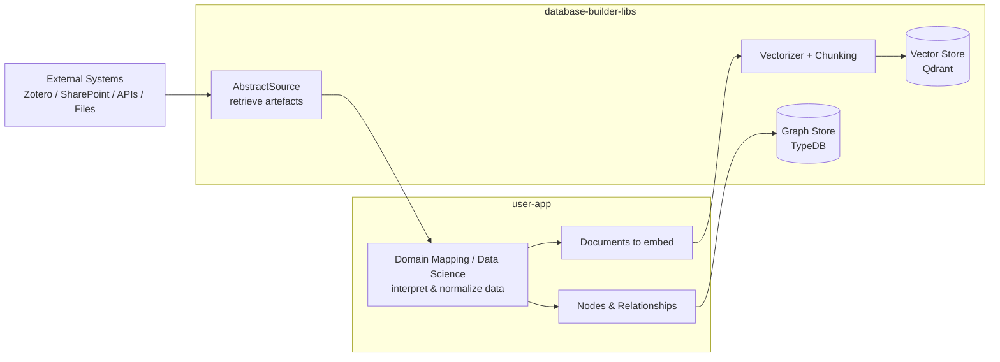

# Architectural overview

`database-builder-libs` provides a structured ingestion backbone for building knowledge systems.
It does **not** decide what the data means — it only guarantees that once meaning is provided, it can be stored, indexed, and retrieved consistently.

The pipeline is intentionally split into two parts:

* **Outside the library** — interpretation and domain logic
* **Inside the library** — synchronization, indexing, and persistence

This separation keeps the library reusable across domains while still supporting complex knowledge models.

---

### Artefact retrieval

The library standardizes access to external systems through the `AbstractSource` interface.

A source implementation is responsible only for:

* connecting to an external system
* listing modified artefacts
* returning normalized content objects

At this stage the library treats data as opaque payload.
No semantic processing, enrichment, or classification occurs here.

The purpose of this layer is to make heterogeneous systems behave like a consistent incremental data stream.

---

### Domain interpretation (outside the library)

After retrieval, the data leaves the responsibility of the library.

The application interprets the content and produces two independent outputs:

1. **Documents** — unstructured information suitable for semantic retrieval
2. **Nodes & relationships** — structured facts suitable for logical storage

The library intentionally does not provide tooling for this step because correctness depends entirely on domain knowledge.
Embedding or storing uninterpreted data would make the system unreliable.

The library therefore acts as a persistence engine, not a knowledge extraction framework.

---

### Document indexing

Documents are re-entered into the library through the vectorization pipeline.

The library then:

1. Splits documents into chunks
2. Converts chunks into embeddings
3. Stores vectors in the vector datastore

This produces a semantic index that supports similarity-based retrieval.
The vector store answers relevance questions, not factual questions.

---

### Knowledge storage

Structured entities and relationships are stored in the graph datastore.

This layer represents explicit knowledge:

* entities
* attributes
* relations

Unlike the vector index, the graph represents deterministic information.
It is intended for correctness and reasoning rather than relevance.

---

## System roles

The library manages persistence and retrieval mechanics:

| Responsibility       | Provided by |
| -------------------- | ----------- |
| Synchronization      | library     |
| Chunking & embedding | library     |
| Vector storage       | library     |
| Graph storage        | library     |
| Domain meaning       | application |
| Ontology decisions   | application |
| Data interpretation  | application |

---

## Architectural intent

The library separates **knowledge interpretation** from **knowledge storage**.

This allows:

* different applications to share the same storage infrastructure
* consistent indexing guarantees
* deterministic persistence behaviour
* interchangeable domain models
